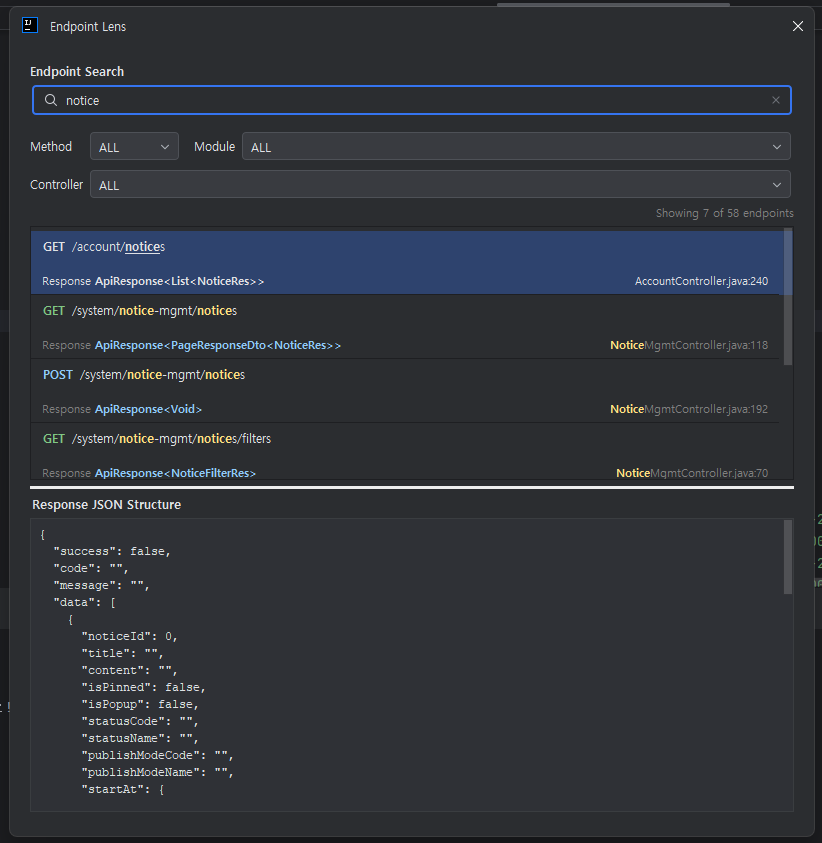

# Endpoint Lens

> Navigate Spring HTTP endpoints at the speed of thought.

**Endpoint Lens** is an IntelliJ IDEA plugin that indexes every Spring MVC / Spring Boot controller endpoint in your project and puts them at your fingertips — searchable, filterable, and previewable without ever leaving the IDE.

---

## Features

### Endpoint Search & Navigation
- Instantly search across all HTTP endpoints in the project by path, method, controller, or module.
- Supports partial path matching, HTTP method prefix (e.g. `GET /users`), and free-text queries.
- Double-click or press `Enter` to jump directly to the controller method in source code.

### Response JSON Structure Preview
- Select any endpoint and see an auto-generated JSON structure preview based on the method's return type.
- Deeply resolves nested objects, collections, generics (`ResponseEntity<T>`, `Page<T>`, etc.) into a human-readable JSON shape.
- Powered by static analysis — no server required.

### Smart Filtering
- Filter endpoints by **HTTP method** (GET, POST, PUT, PATCH, DELETE).
- Filter by **module** in multi-module projects.
- Filter by **controller class** to narrow down results instantly.
- All filters are combinable and update results in real time.

### Search Highlight
- Matched tokens are highlighted with high-visibility yellow markers directly in the results list.
- Works across both the path and location fields.

### Duplicate Endpoint Detection
- Built-in inspection warns you about duplicate HTTP mappings (same method + path) before they cause runtime ambiguity.
- Highlights the conflicting methods with IDE-level `WARNING` markers.
- Right-click any endpoint → **Show duplicates** to see all conflicting definitions.

### Keyboard-first Workflow
- Open the search popup from anywhere with `Ctrl+Alt+H`.
- Navigate results with `↑` / `↓` without leaving the search field.
- Popup closes automatically after navigating to a result.

### Tool Window
- Persistent **Endpoint Lens** panel docked to the right side of the IDE.
- Always in sync — re-indexes automatically when source files change.

---

## Installation

1. Open **Settings → Plugins → Marketplace**.
2. Search for **Endpoint Lens**.
3. Click **Install** and restart the IDE.

Or install manually:
1. Download the `.zip` from the [Releases](https://github.com/mingovvv/endpoint-lens-plugin/releases) page.
2. Go to **Settings → Plugins → ⚙ → Install Plugin from Disk…**

---

## Usage

| Action | How |
|---|---|
| Open search popup | `Ctrl+Alt+H` |
| Navigate to endpoint | `Enter` or double-click |
| Filter by method | Select from the **Method** dropdown |
| Filter by module | Select from the **Module** dropdown |
| Filter by controller | Select from the **Controller** dropdown |
| Copy endpoint path | Right-click → **Copy endpoint** |
| Copy curl template | Right-click → **Copy curl template** |
| Copy response JSON | Right-click → **Copy response JSON example** |
| Check duplicates | Right-click → **Show duplicates** |

---

## Requirements

- IntelliJ IDEA **2024.2** or later (Community or Ultimate)
- Java **17+** project using Spring MVC or Spring Boot
- Gradle or Maven — no additional configuration needed

---

## Compatibility

| IDE Version | Supported |
|---|---|
| 2024.2 (242) | ✓ |
| 2024.3 (243) | ✓ |
| 2025.1 (251) | ✓ |
| 2025.2 (252) | ✓ |

---

## Changelog

### 1.1.1
- Dynamic generic wrapper unwrapping (no more hardcoded wrapper list).
- Fixed generic record type parsing (e.g. `PageResponseDto<T>`).
- Enum and date/time types now render correctly in JSON preview.
- `@Schema(example = "...")` values are reflected in JSON preview.

### 1.1.0
- Added **Response JSON Structure** preview panel.
- Improved search UX with magnifier icon and clear button.
- Enhanced search highlight with yellow token markers.
- Redesigned filter layout with aligned columns.
- Popup auto-closes on endpoint navigation.
- Location display simplified to `filename:line`.
- Endpoint count status label added below filters.
- Updated tool window icon.

### 1.0.0
- Initial release.
- Project-wide indexing of Spring HTTP endpoints.
- Searchable endpoint navigation via tool window and popup.
- Duplicate endpoint inspection with IDE warnings.

---

## License

MIT License — see [LICENSE](LICENSE) for details.
